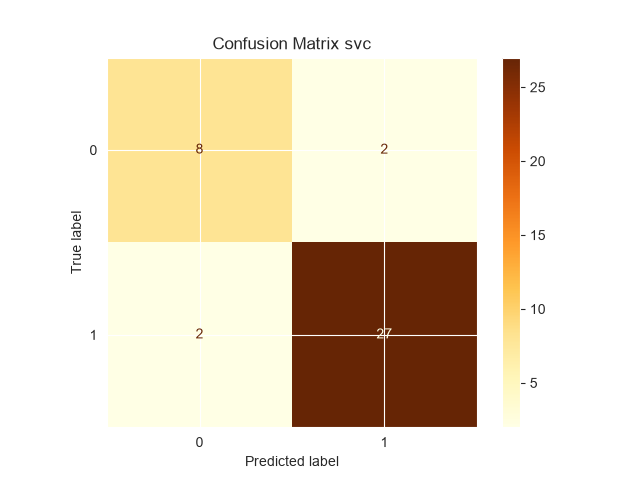
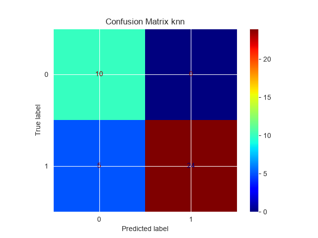
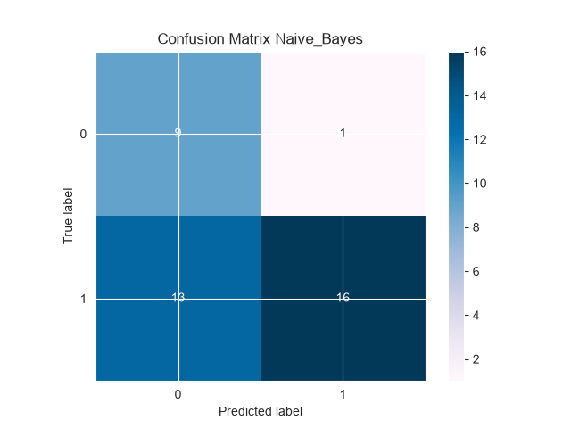

# Parkinson's Disease Classification using Machine Learning


## Overview

This project presents a machine learning approach for classifying Parkinson's disease using biomedical voice measurements. The workflow includes data preprocessing, exploratory data analysis (EDA), feature engineering, model training, and performance evaluation. The primary objective is to accurately classify individuals as healthy or affected by Parkinson's disease based on voice-related biomedical features.

---

## Dataset

The dataset contains biomedical voice measurements collected from individuals with and without Parkinson's disease.

- **Samples:** 195
- **Features:** 24
- **Target:** `status`
- **Data Type:** Biomedical voice measurements

The dataset includes several voice-related features such as frequency measurements, jitter, shimmer, noise-to-harmonics ratio (NHR), recurrence period density entropy (RPDE), detrended fluctuation analysis (DFA), and other nonlinear dynamical measures that are useful for Parkinson's disease classification.

---

## Project Structure

```text
Parkinson/
├── data/                 # Dataset
├── images/               # Figures and visualizations
├── models/               # Saved machine learning models
├── notebooks/            # Jupyter notebooks
├── src/                  # Source code
├── requirements.txt      # Project dependencies
└── README.md             # Project documentation
```

---

## Features

- Data preprocessing
- Exploratory Data Analysis (EDA)
- Data visualization
- Feature engineering
- Machine Learning model development
- Model evaluation
- Model serialization for future use

---

## Installation

```bash
git clone https://github.com/Eerfan-Nemati/Parkinson.git
cd Parkinson
pip install -r requirements.txt
```

---

## Usage

1. Clone the repository.
2. Install the required dependencies using `requirements.txt`.
3. Open the `notebooks` directory.
4. Launch `parkinsons_classification.ipynb` using Jupyter Notebook or JupyterLab.
5. Run all notebook cells sequentially.

---

## Requirements

Install the required libraries using:

```bash
pip install -r requirements.txt
```

---

## Results

The project evaluates machine learning models using standard classification metrics and visualization techniques. Performance evaluation plots and analysis are available in the notebook and the `images` directory.

---

## Author

**Erfan Nemati**

GitHub: https://github.com/Eerfan-Nemati

---

## License

This project is intended for educational and research purposes.

## Results

Three machine learning models were evaluated on the Parkinson's Disease dataset.

| Model | Accuracy | Precision | Recall | F1-score |
|-------|----------|-----------|---------|----------|
| SVC | **89.7%** | 93.1% | **93.1%** | **93.1%** |
| KNN | 87.2% | **100%** | 82.8% | 90.6% |
| Gaussian Naive Bayes | 64.1% | 94.1% | 55.2% | 69.6% |
## Confusion Matrices

<p align="center">
  
  
  
</p>
### Best Model
Support Vector Classifier (SVC) achieved the best overall performance, providing the highest Accuracy, Recall, and F1-score while maintaining high Precision. Therefore, SVC was selected as the final model for this project.
